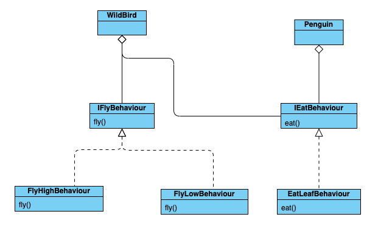

1h44 27/7/24 goy nhưng mà giờ mí viết được. ựa

# Day 1 - 26/7/2024

Nay trên công ty mình train cho Cropper, sau đó anh Đức chỉ về @classmethod và @abstractmethod

## Một vài điều vô tri chưa nhớ

1. int8 là từ -2^8 đến 2^8 tức là ừ -128 đến 128. Vậy nên nếu chuyển 1 image thành numpy array mình nên dùng unit8 hoặc int16 hoặc khác
2. ta có hàm eval() để chuyển đổi 1 string thành number
```python
eval("[1,2,3]")
>>> [1,2,3]
eval(2*5)
>>> 10
eval(["1","2","3"])
>>>[1,2,3]
```
hoặc code lại, tự nhiên lười dùng thêm thư viện `ast` kaka
3. Lập trình hướng đối tượng - OOP là viết tắt của Object-Oriented Programming, trong đó Oriented là có hướng, được định hướng
4. 4 đặc tính của lập trình hướng đối tượng đó là 
- tính đóng gói - encapsulation
- tính kế thừa - inheritance: cho phép kế thừa những tính năng mà một đối tượng khác đã có, giúp tránh việc code lặp lại dư thừa. Kế thừa một cấp - single level, kế thừa nhiều cấp - multiple level
- tính đa hình - polymorphism: một đối tượng thuộc các lớp khác nhau có thể hiểu cùng một thông điệp theo cách khác nhau
- tính trừu tượng - abstraction: phương pháp trừu tượng hóa định nghĩa lên những hành động, tính chất của loại đối tượng nào đó cần phải có
5. learn on tiktok (a Đức gửi): không thể phủ nhận sức mạnh của Inheritance nhưng cần xem xét áp dụng một cách hợp lý chứ không lạm dụng một cách bừa bãi gây ra những rắc rối.

*Nguyên lý Composition over Inheritance*: gom các phương thức chung vào một đối tượng riêng sau đó thực hiện tham chiếu các đối tượng mới được khởi tạo

Composition nghĩa là thành phần -> ví dụ `bánh xe`  là thành phân của `Xe ô tô` hay `Xe ô tô ` chứa 1 instance(thuộc 
tính) kiểu `bánh xe`, tương tự `Xe ô tô ` còn có `Đèn `, ` Động cow`. Và mỗi một thuộc tính có các function - chức năng 
riêng. Ví dụ `func: TurnOn / TurnOff` của `Đèn `, `func: Start()` của `Động cơ `, và `func: run()` của ` bánh xe`. Thay
vì để tất cả các chức năng nhỏ của từng bộ phận để chung vào `Xe ô tô` thì ta để từng chức năng ở mỗi Composition

Khi thêm mới/ thay đổi các hành vi của đối tượng thì không cần phải thay đổi quá nhiều code hiện có, chỉ cần viết thêm 
code và thay thế các hành vi mới vào hành vi hiện tại. (Đảm bảo nguyên lí SRP và OCP).

**Nguyên lý SRP với OCP là gì mị không biết mai mị học!!!!**

*Nguyên tắc DRY*: Don't repeat yourself



## Learning new things
### 1. Classmethod and abstractmethod explain
Classmethod = Class + method = Một lớp và lớp đó có một phương thức

Instance methods hoạt động trên trạng thái của **một đối tượng** còn class methods hoạt động trên chính lớp đó (chúng 
không có quyền truy cập vào đối tượng) và chúng có sẵn cho **tất cả đối tượng** của lớp đó.

### 2. Abstract class là gì?
Abstract class = bản thiết kế cho các class khác, trừu tượng hóa class để đưa về một chuẩn chung nhất định như là 1 
khung xương hay là một bản thiết kế -> một class chứa phương thức abstract là Abstract class

Phương thức abstract là phương thức có khai báo nhưng không có bất kỳ triển khai nào: `pass`, các abstract class không 
thể khởi tạo và nó cần class con để triển khai cho phương thức được định nghĩa trong phương thức abstract.

-> Việc sử dụng abstract class cho phép cung cấp các chức năng mặc định cho các class con - Abstract Base Class (ABC)

### 3. Abstract Base Class - ABC
Python không cung cấp ABC mà ta sử dụng mô-đun Abstract Base Class để làm điều đó
```python
from abc import ABC
```
Khai báo
```python
from abc import ABC, abstractmethod

class Polygon(ABC):
    @abstractmethod
    def draw(self):
        pass
    def get_area(self):
        pass

#class thứ 2 implement từ abstractClass
class Rectangle(Polygon):
    def __init__(self, width, height):
        self.width = width
        self.height = height
    def draw(self):
        print('Tự vẽ đi, vẽ cũng lười')
    
    def get_area(self):
        return self.width*self.height

rectangle = Rectangle(8,4)
rectangle_area =rectangle.get_area()
>>>32
```
### 4.Class Method – Phương thức thuộc về lớp
Decorator @classmethod là một function decorator được tích hợp sẵn của Python, nó là một biểu thức mà được xử lý 
sau khi hàm của bạn được định nghĩa. Kết quả của phép xử lý biểu thức đó sẽ được phản chiếu lên phần code định nghĩa
hàm của bạn.

Một class method là một method – phương thức mà được gắn với class, mà không phải là gắn với đối tượng của class.

Các class methods có quyền truy cập đến trạng thái của class, bởi vì chúng đều nhận vào một tham số mà trỏ đến class, 
chứ không phải trỏ đến đối tượng/thể hiện.

#### Static method – Phương thức tĩnh
Static method không nhận vào đối số đầu tiên ngầm định nào.

Một static method là một method – phương thức mà được gắn với class, chứ không phải gắn với đối tượng của class.

Static method không thể truy cập hay sửa đổi trạng thái của class.

Static method hiện diện bên trong class bởi vì nó có ý nghĩa đối với method – phương thức có mặt trong class.

#### Class method và Static method
– Class method nhận vào cls làm tham số đầu tiên, trong khi static method không cần tới tham số đặc biệt nào.

– Class method có thể truy cập hoặc sửa đổi trạng thái của class, trong khi static method không thể truy cập tới hay sửa đổi nó.

– Nói chung, static method không biết gì về trạng thái của class

-> Chúng ta thường sử dụng class method để tạo ra các factory methods. Các factory methods sẽ trả về đối tượng của
lớp (tương tự như một hàm constructor) cho các trường hợp sử dụng khác nhau.

-> Chúng ta sẽ thường sử dụng các static methods để tạo ra các hàm tiện ích (utility functions).

```python
from datetime import date 
  
class Person: 
    def __init__(self, name, age): 
        self.name = name 
        self.age = age 
    # instance method take self as the first argument
    def height(self):
        print('My height is 1m50')
    
    # a class method to create a Person object by birth year. 
    # access to the class's state as it takes a class parameter
    @classmethod
    def fromBirthYear(cls, name, year): 
        return cls(name, date.today().year - year) 
      
    # a static method to check if a Person is adult or not. 
    # static method is logically related to the class, but does not necessarily
    @staticmethod
    def isAdult(age): 
        return age > 18
  
person1 = Person('mayank', 21) 
person2 = Person.fromBirthYear('mayank', 1996) 
  
print(person1.age) #21
print(person2.age) #21
  
# print the result 
print(Person.isAdult(22))
```
? Mình nói chuyện với bạn là bạn đặt 1 câu hỏi giúp mình hiểu thêm về classmethod: Tại sao phải cho classmethod làm gì?
Sao không cứ làm như bình thường, truyền vào `__init__()` bình thường

và mình thấy có 1 lý do như này, giả sử như bài trên biến `year` được sử dụng 1 lần, và nếu để `year` vào trong `__init__()`
vậy thì khi khai báo mình bắt buộc phải truyền thông tin của `year` như vậy không cần thiết.

### 5. Clean code with abstract class
ngủ tí 3h30 goy, mai viết

Hế lu gặp lại

Nếu như bạn không muốn phải khai báo và nghĩ đồng thời nhớ quá nhiều function có chức năng tương tự nhau nhưng thuộc 
các lớp khác nhau (Thủy tự bịa ra lý do này đấy)

Ví dụ như kiểu chúng ra có hàm `feed_lion()` của class `Lion()`, hàm `feed_cow()` thuộc class `Cow()` và `feed_capybara()`
thuộc class `Capybara()` và các hàm này có chung mục đích là để cho ăn

<div style="display: flex;">
  <div style="flex: 1; width: 500px">
    <pre><code class="language-python">
class Lion():
    def feed_lion():
        return xyz
class Cow():
    def feed_cow():
        return xyz
class Capybara():
    def feed_capybara():
        return xyz
    </code></pre>
  </div>
  <div style="flex: 1; width: 24px">
    <p style="font-size: 24px;">&rarr;</p>
  </div>
  <div style="flex: 1; width: 500px">
    <pre><code class="language-python">
from abc import ABC, abstractmethod
# abc is a builtin module, we have to import ABC and abstractmethod

class Animal(ABC): # Inherit from ABC(Abstract base class)
    @abstractmethod 
    def feed(self):
        pass
class Panda(Animal): 
    def wrong_name(self): # The method's name must match the name of the ABC's method
        print("Feeding a panda with some tasty bamboo!")
class Lion(Animal):
    def feed(self):
        
class Cow(Animal): 
    def feed(self): 
        
class Capybara(Animal): 
    def feed(self): 
    </code></pre>
    </div>
</div>

Chúng ta cũng hoàn toàn có thể thêm các parameters khác cho class con
```python
class Lion(Animal): 
    def feed(self, action, time): 
        # It's still mandatory to implement action. 
        # "time" is our other parameter
        print(f"{action} a lion! At {time}") 
```

##### Writing abstract properties
Properties tiếng anh là tính chất đặc tính - việc tạo abstract properties buộc các lớp con -subclass phải triển khai 
thuộc tính đó

```python
from abc import ABC, abstractmethod

class Animal(ABC):
    @property                 
    def food_eaten(self):     
        return self._food

    @food_eaten.setter
    def food_eaten(self, food):
        if food in self.diet:
            self._food = food
        else:
            raise ValueError(f"You can't feed this animal with {food}.")

    @property
    @abstractmethod
    def diet(self):
        pass

    @abstractmethod 
    def feed(self, time):
        pass

class Lion(Animal):
    @property                 
    def diet(self):     
        return ["antelope", "cheetah", "buffaloe"]

    def feed(self, time):
        print(f"Feeding a lion with {self._food} meat! At {time}") 
```
Không hiểu lắm, tí đọc lại 

[Datacamp](https://www.datacamp.com/users/sign_in?redirect=http%3A%2F%2Fapp.datacamp.com%2Flearn%2Fcourses%2Fobject-oriented-programming-in-python&dc_referrer=https%3A%2F%2Fcampus.datacamp.com%2F)

# Tomorrow - no it's today lol
1. Tí mình sẽ đọc lại cái này
2. đọc bài Sơn
3. tìm hiểu về xử lý ảnh
4. đọc mail nữa, quá trời 
